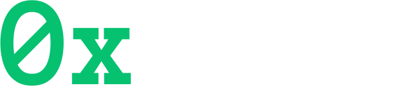

## About the Project

*0x.SKIP* is a decentralized habit tracker designed to help users stay consistent with their habits through a unique blend of privacy, accountability, and gamification. The platform offers public and private habit challenges, peer and AI validation, and rewards for consistent habit tracking.

---

## Features

### 🚀 Core Features

#### Public Habit Challenges:
- Join or create challenges visible to all.
- Crowdsourced validation system ensures fairness.

#### Private Habit Creation:
- Generate a invite code to invite specific participants.
- Restricted access ensures privacy.

#### Dual Validation System:
- Peer validation for a accountability.

### 🔒 Privacy-Focused

#### Private Habit Options:
- Control habit visibility during creation.

#### Secure Sharing Links:
- Share private challenges with selected participants.

#### Blockchain Security:
- Ensure secure and transparent transactions.

#### External Validation:
- Unbiased validation by external participants.

### 🎯 Validation and Accountability

#### Daily Proof Submission:
- Upload proof of your completed activity daily.
- Peer members validate progress.

#### Missed Validation Penalties:
- *1st Miss*: 1% deduction.
- *2nd Miss*: 2% deduction.
- *3rd Miss*: 3% deduction.
- Cycle resets after three missed validations.

#### Fair Refund System:
- Refunds based on validated days.

#### Redistribution of Deductions:
- Missed validation deductions are shared among consistent participants.

---

## How It Works

1. *Join or Create Habits:*
   - Users can participate in public or private challenges.

2. *Daily Updates:*
   - Submit proof of activity completion.

3. *Validation Process:*
   - Peer validation ensure authenticity.

4. *Habit Completion:*
   - Receive rewards or refunds based on validated days.

---

## Tech Stack

- *Web-App:* Next.js
- *Database:* MongoDB
- *Blockchain Integration:* Ether.js
- *Styling:* TailwindCSS

---

## Terms and Conditions

### Participation Guidelines

#### Proof Submission:
- Upload daily activity proof on the app.
- Peer members validate the progress.

#### Missed Validation:
- *1st Miss:* 1% deduction.
- *2nd Miss:* 2% deduction.
- *3rd Miss:* 3% deduction.
- Cycle resets after three missed validations.

#### Refund:
- Refund is proportional to validated days.

#### Deductions Redistribution:
- Deductions shared among consistent participants.

#### No Full Loss Guarantee:
- Refund always reflects validated days.

#### Special Challenges:
- Event-specific penalties and rules may apply for seasonal plans.

---

## Future Enhancements

- *AI-Powered Habit Suggestions:* Personalized habit recommendations.
- *NFT Rewards:* Digital collectibles for consistent participation.
- *Leaderboards:* Compete globally with other users.
- *Enhanced Gamification:* Unlock levels, perks, and exclusive rewards.

---

### Let’s Build Better Habits Together! 🌟
